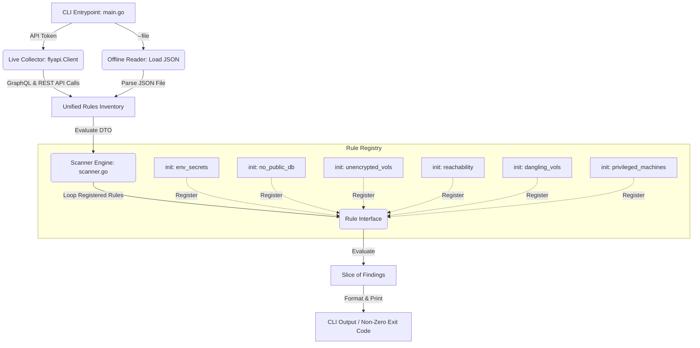

# FlyCSPM

**FlyCSPM** is a lightweight, extensible Cloud Security Posture Management (CSPM) CLI tool written in Go. It scans Fly.io environments—evaluating application, network, machine, and volume configurations—against a suite of security best practices to identify misconfigurations.

Two scan modes:
1. **Live API Scan**: Queries the Fly.io GraphQL and REST APIs using your Fly token.
2. **Offline Scan**: Evaluates a local JSON inventory without making network calls (ideal for CI/CD).

---

##  Architecture & Extensibility

Data flow through the application:



### Key Design Patterns

* **Interface-Driven Security Rules**: Each security check implements the `Rule` interface:
  ```go
  type Rule interface {
      ID() string
      Name() string
      Description() string
      Severity() Severity
      Evaluate(ctx context.Context, inventory *Inventory) ([]Finding, error)
  }
  ```
* **Decoupled Rule Registry**: Rules register themselves automatically on startup via Go's `init()` block:
  ```go
  func init() {
      rules.Register(&NoPublicDB{})
  }
  ```
  This enables **plugin-like extensibility**. Adding a new security rule requires zero modifications to the scanner orchestrator or the main CLI tool; you simply drop a new file into the `pkg/rules` directory.
* **Unified Data Transfer Object (DTO)**: The `rules.Inventory` struct acts as a consolidated snapshot of the target architecture. This allows rules to perform cross-resource correlation (e.g. comparing App config against Volume properties).

---

## Implemented Security Rules

FlyCSPM evaluates the following policies:

| Rule ID | Rule Name | Severity | Target Resource | Rule Logic |
| :--- | :--- | :--- | :--- | :--- |
| **FLY-SEC-001** | Env Variable Secrets | `HIGH` | App & Machine | Inspects environment variables for plaintext secrets (e.g. password, API key, auth token, database URL). |
| **FLY-NET-001** | No Public Databases | `CRITICAL` | App | Ensures database apps (e.g., Postgres, Redis) do not expose public IPv4/IPv6 endpoints. They should only utilize private WireGuard or 6PN. |
| **FLY-NET-002** | Publicly Reachable Database Attack Path | `CRITICAL` | Machine | Graph traversal (BFS) over public IPs and active port bindings to verify a database machine is internet-reachable. |
| **FLY-VOL-001** | Orphaned Volumes | `MEDIUM` | Volume | Identifies volumes in a detached state or belonging to an app with no active machines. |
| **FLY-VOL-002** | Unencrypted Storage Volumes | `HIGH` | Volume | Checks if provisioned volumes have encryption disabled. |
| **FLY-MAC-001** | Privileged Machine Container Execution | `HIGH` | Machine | Checks for machines running with privileged container flags, which bypass container isolation. |

---

## Getting Started

### Prerequisites
* Go 1.21 or higher
* (Optional) [Fly CLI (`flyctl`)](https://fly.io/docs/flyctl/install/) authenticated for live scans.

### Installation
Clone the repository and build the binary:
```bash
git clone https://github.com/neelabhsarkar/flycspm.git
cd flycspm
go build -o flycspm ./cmd/flycspm
```

### Usage

#### Offline scan
```bash
./flycspm --file test_inventory.json
```

#### Live API scan
```bash
export FLY_API_TOKEN="your_fly_api_token"
./flycspm
```

#### Filter by app name
```bash
./flycspm --filter "prod-"
```

---

## Running Tests

Run with coverage:
```bash
go test -v -race -cover ./...
```

To view the coverage report:
```bash
go test -coverprofile=coverage.out ./...
go tool cover -html=coverage.out
```

---

## How to Add a New Rule
1. Create `pkg/rules/my_new_rule.go` implementing the `Rule` interface.
2. Add an `init()` block calling `rules.Register(&MyNewRule{})`.
3. Create `pkg/rules/my_new_rule_test.go` with unit test scenarios.

The scanner picks it up automatically — no changes needed elsewhere.
