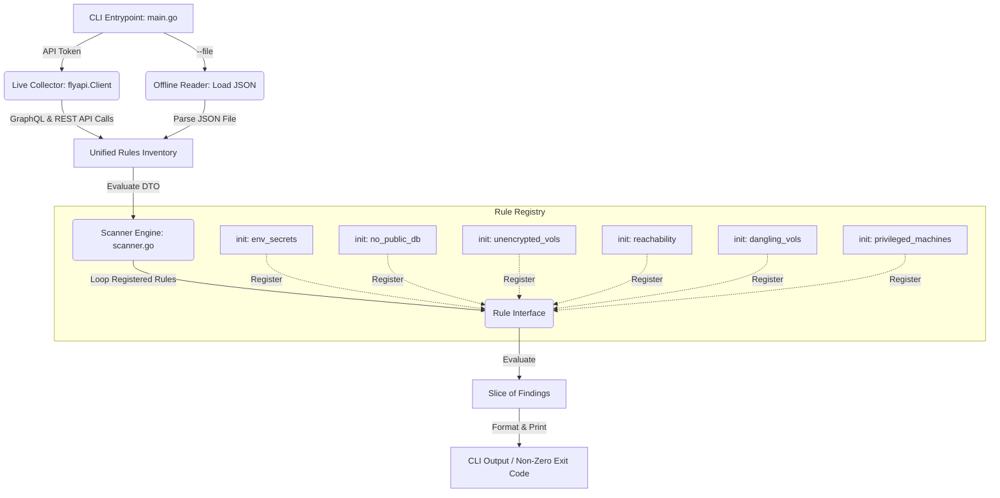

# FlyCSPM 🛡️
[](https://github.com/neelabhsarkar/flycspm/actions)
[](https://goreportcard.com/report/github.com/neelabhsarkar/flycspm)
[](https://golang.org)

**FlyCSPM** is a lightweight, extensible Cloud Security Posture Management (CSPM) command-line interface (CLI) tool written in Go. It scans Fly.io environments—evaluating application, network, machine, and volume configurations—against a suite of security best practices to identify security risks and misconfigurations.

This tool can be run in two modes:
1. **Live API Scan**: Queries the Fly.io GraphQL and REST APIs to fetch real-time configurations using your Fly token.
2. **Offline Local Scan**: Evaluates local configuration exports (JSON inventory format) without making external network calls (ideal for CI/CD pipelines).

---

## 🏗️ Architecture & Extensibility

FlyCSPM is designed with modularity, decoupling, and high testability in mind. Below is an architectural overview of how data flows through the application:



### Key Design Patterns

* **Interface-Driven Security Rules**: Each security check implements the `Rule` interface:
  ```go
  type Rule interface {
      ID() string
      Name() string
      Description() string
      Severity() Severity
      Evaluate(ctx context.Context, inventory *Inventory) ([]Finding, error)
  }
  ```
* **Decoupled Rule Registry**: Rules register themselves automatically on startup via Go's `init()` block:
  ```go
  func init() {
      rules.Register(&NoPublicDB{})
  }
  ```
  This enables **plugin-like extensibility**. Adding a new security rule requires zero modifications to the scanner orchestrator or the main CLI tool; you simply drop a new file into the `pkg/rules` directory.
* **Unified Data Transfer Object (DTO)**: The `rules.Inventory` struct acts as a consolidated snapshot of the target architecture. This allows rules to perform cross-resource correlation (e.g. comparing App config against Volume properties).

---

## 🔒 Implemented Security Rules

FlyCSPM evaluates the following compliance policies:

| Rule ID | Rule Name | Severity | Target Resource | Rule Logic |
| :--- | :--- | :--- | :--- | :--- |
| **FLY-SEC-001** | Env Variable Secrets | `HIGH` | App & Machine | Inspects environment variables for plaintext secrets (e.g. password, API key, auth token, database URL). |
| **FLY-NET-001** | No Public Databases | `CRITICAL` | App | Ensures database apps (e.g., Postgres, Redis) do not expose public IPv4/IPv6 endpoints. They should only utilize private WireGuard or 6PN. |
| **FLY-NET-002** | Exposed Services Port | `MEDIUM` | App | Scans for apps that expose unencrypted HTTP or high-risk ports directly to the public internet. |
| **FLY-VOL-001** | Unencrypted Volumes | `HIGH` | Volume | Checks if provisioned volumes have storage encryption disabled. |
| **FLY-VOL-002** | Dangling/Detached Volumes | `LOW` | Volume | Identifies volumes that are in a detached state to prevent stale data accumulation and unnecessary costs. |
| **FLY-SYS-001** | Privileged Machines | `HIGH` | Machine | Checks for Fly machines running with kernel/system privileges (privileged containers). |

---

## 🚀 Getting Started

### Prerequisites
* Go 1.21 or higher
* (Optional) [Fly CLI (`flyctl`)](https://fly.io/docs/flyctl/install/) authenticated for live scans.

### Installation
Clone the repository and build the binary:
```bash
git clone https://github.com/neelabhsarkar/flycspm.git
cd flycspm
go build -o flycspm ./cmd/flycspm
```

### Usage

#### 1. Offline Scan (Recommended for CI/CD)
To run a scan against local configuration data (without making network calls):
```bash
./flycspm --file test_inventory.json
```

#### 2. Live API Scan
Make sure you are logged in to flyctl, or set the `FLY_API_TOKEN` environment variable, then execute:
```bash
export FLY_API_TOKEN="your_fly_api_token"
./flycspm
```

#### 3. Filtering Applications
Scan only applications matching a specific substring:
```bash
./flycspm --filter "prod-"
```

---

## 🧪 Running Tests
This project includes extensive unit test suites covering the API parser, mock response servers, rule evaluations, and scanning orchestrator. 

To run the tests with coverage:
```bash
go test -v -race -cover ./...
```

To view the coverage report:
```bash
go test -coverprofile=coverage.out ./...
go tool cover -html=coverage.out
```

---

## 🛠️ How to Add a New Rule
Adding a new rule is straightforward:
1. Create a new Go file under `pkg/rules/` (e.g., `pkg/rules/my_new_rule.go`).
2. Define a struct implementing the `Rule` interface.
3. Write an `init()` block calling `rules.Register(&MyNewRule{})`.
4. Create a test file (`pkg/rules/my_new_rule_test.go`) containing unit test scenarios.
5. Compile and run. The scanner engine will dynamically register and run your check.
